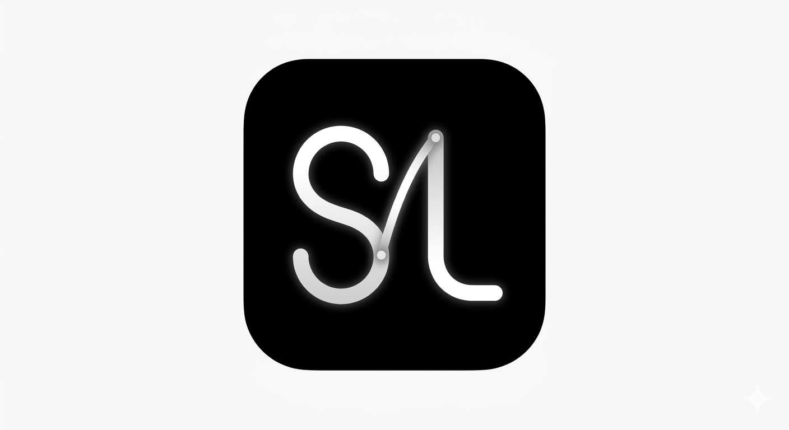

<div align="center">
  
  <h1>Still</h1>
  <p>A focused audio player built for musicians and language learners</p>

  
  
  
  
  
</div>

---

## Overview

**Still** is a lightweight, offline-first audio player designed for deliberate practice. Whether you're learning a new instrument, studying pronunciation, or transcribing music, Still gives you precise control over every second of your audio.

No streaming. No subscriptions. Just your files and your focus.

---

## Screenshots

> Player screen with A-B loop controls, waveform, and transport

---

## Features

### 🎵 Audio Playback
- Play, pause, stop with clean transport controls
- Seek anywhere on the progress bar with a single tap
- Real-time waveform visualization
- Background playback — audio keeps playing when you switch apps
- Lock screen controls with track metadata
- Playback speed control — 0.5×, 0.75×, 1×, 1.25×, 1.5×, 2× presets, rate is preserved when switching tracks

### 🔁 A-B Loop Repeat
- Set a start point **A** and end point **B** to loop any segment
- Fine-tune A and B markers frame-by-frame with `◀ ▶` buttons
- Visual markers on the progress bar so you always know where you are
- One-tap clear to release the loop

### ⏱ Practice Timer
- **Countdown mode** — set a duration in minutes; the audio fades out gracefully when time is up
- **Loop counter mode** — set a target number of A-B repetitions; Still counts every loop automatically and stops when you hit your goal

### 📁 Library
- Import any `.mp3` or `.wav` file from your device storage
- Files are copied into the app's private sandbox — no cloud required
- Swipe-to-delete or long-press to remove tracks
- Persisted across sessions via AsyncStorage

### 🌐 Web Support
- Runs in any modern browser via Expo web (React Native Web)
- Audio import uses the browser's native file picker (no native file-system APIs required)
- Playback powered by the HTML5 Audio API
- All features (A-B loop, speed control, timer) work identically on web and native

---

## Tech Stack

| Layer | Technology |
|---|---|
| Framework | [React Native 0.81](https://reactnative.dev) + [Expo SDK 54](https://expo.dev) |
| Language | TypeScript 5.9 (strict) |
| Navigation | [Expo Router 6](https://expo.github.io/router) (file-based) |
| Audio | [expo-audio](https://docs.expo.dev/versions/latest/sdk/audio/) |
| File Import | [expo-document-picker](https://docs.expo.dev/versions/latest/sdk/document-picker/) |
| Storage | [AsyncStorage](https://react-native-async-storage.github.io/async-storage/) + expo-file-system |
| State | `useSyncExternalStore` + custom `AudioEngine` singleton |
| Icons | [lucide-react-native](https://lucide.dev) |
| JS Engine | Hermes |
| Architecture | New Architecture (Fabric + TurboModules) |

---

## Project Structure

```
still/
├── app/                     # Expo Router screens
│   ├── _layout.tsx          # Root layout (tab navigator)
│   ├── index.tsx            # Player screen
│   └── library.tsx          # Library screen
├── src/
│   ├── engine/
│   │   ├── AudioEngine.ts       # Core playback engine (singleton class)
│   │   ├── AudioEngineContext.tsx
│   │   └── useAudioEngine.ts    # React hook for engine state
│   ├── components/
│   │   ├── WaveformView.tsx     # Real-time waveform
│   │   ├── ProgressBar.tsx      # Seekable progress bar with A-B markers
│   │   ├── TrackInfo.tsx        # Track name + current time display
│   │   ├── TransportControls.tsx
│   │   ├── ABControls.tsx       # A-B marker controls + fine-tune
│   │   ├── SpeedControl.tsx     # Playback speed presets (0.5×–2×)
│   │   ├── TimerPanel.tsx       # Countdown & loop counter UI
│   │   └── FileListItem.tsx     # Library list row
│   ├── hooks/
│   │   └── useTimerManager.ts   # Timer logic (countdown + loop counter)
│   ├── services/
│   │   ├── AudioEngine.ts
│   │   ├── FileManager.ts       # Import / delete audio files
│   │   └── StorageService.ts    # Persist track list
│   ├── constants/
│   │   ├── theme.ts             # Colors, spacing, typography
│   │   └── config.ts            # Fine-tune step size, etc.
│   ├── types/
│   │   ├── audio.ts
│   │   └── timer.ts
│   └── utils/
│       └── formatTime.ts
├── assets/
│   ├── logo-still.png
│   └── splash-icon.png
├── app.json                 # Expo config (name, icons, package id)
└── package.json
```

---

## Getting Started

### Prerequisites

- Node.js 18+
- Android Studio + Android SDK (API 24+)
- JDK 17
- For physical device: USB debugging enabled

### Install Dependencies

```bash
git clone https://github.com/Allengl/still-player.git
cd still-player
npm install
```

### Run on Android

```bash
# Generate native Android project (first time)
npx expo prebuild --platform android

# Run on a connected device or emulator
npm run android
```

### Build a Release APK Locally

```bash
# Full build (all architectures)
cd android && ./gradlew assembleRelease

# arm64-v8a only (smaller size, modern devices)
cd android && ./gradlew assembleRelease -PreactNativeArchitectures=arm64-v8a
```

Output: `android/app/build/outputs/apk/release/app-release.apk`

### Release via GitHub Actions (recommended)

Releases are built automatically by CI. Just push a version tag:

```bash
git tag v1.1.0
git push origin v1.1.0
```

GitHub Actions will:
1. Generate the Android project with `expo prebuild`
2. Build the **arm64** APK (`~30 MB`)
3. Build the **universal** APK (`~73 MB`, all ABIs)
4. Publish both as a [GitHub Release](https://github.com/Allengl/still-player/releases) with install instructions

You can also trigger a release manually from the **Actions** tab in the repository using the `workflow_dispatch` option and entering a version number.

---

## Download

Download the latest APKs from the **[GitHub Releases](https://github.com/Allengl/still-player/releases/latest)** page.

| APK | Architectures | Size | Best for |
|-----|--------------|------|----------|
| `Still-vX.X.X-arm64.apk` | arm64-v8a | ~30 MB | Modern Android phones ✅ recommended |
| `Still-vX.X.X-universal.apk` | armeabi-v7a · arm64-v8a · x86 · x86_64 | ~73 MB | All devices & emulators |

Install via ADB:
```bash
# Recommended for modern devices
adb install Still-vX.X.X-arm64.apk
```

> APK binaries are not stored in the repository. Every tagged release is built
> automatically by the CI workflow and attached to the corresponding
> [GitHub Release](https://github.com/Allengl/still-player/releases).

---

## How It Works

### AudioEngine

`AudioEngine` is a plain TypeScript class that owns all playback state. It follows the `useSyncExternalStore` contract — React subscribes to it and re-renders only when state actually changes.

```
AudioEngine
  └── expo-audio AudioPlayer          ← native layer
  └── A-B loop enforcement            ← seekTo(pointA) on every status tick
  └── notifies all React subscribers  ← via useSyncExternalStore
```

### A-B Loop

Every 50 ms the native player emits a `playbackStatusUpdate`. When A-B mode is active, `AudioEngine` checks if `currentTime >= pointB`. If so, it calls `seekTo(pointA)` and emits a `loopCompleted` event — which the timer's loop counter listens to.

### Timer

The `useTimerManager` hook handles two independent modes:
- **Countdown** — a `setInterval` counting down milliseconds. When it reaches zero, volume is faded to 0 over 3 seconds via the engine's `setVolume`.
- **Loop counter** — listens to the engine's `onLoopCompleted` event and increments a counter until the target is hit, then stops.

---

## App Info

| Field | Value |
|---|---|
| App Name | Still |
| Package ID | `com.still.player` |
| Version | 1.0.0 |
| Min SDK | Android 7.0 (API 24) |
| Target SDK | API 36 |
| Architectures | arm64-v8a · armeabi-v7a · x86 · x86_64 (universal) |
| Web | Supported (Expo Web / React Native Web) |

---

## License

MIT © 2025 Allengl